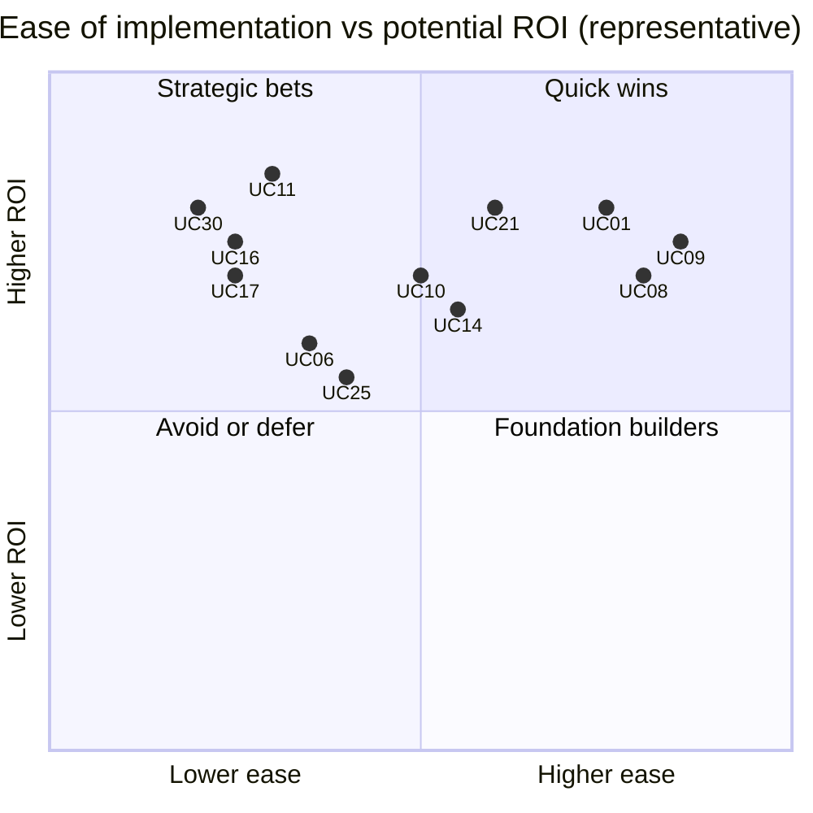
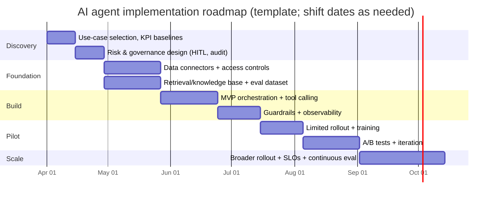

# AI Systems and Agent Integrations for Cross-Industry Business Value

## Executive summary

The economic rationale for enterprise AI systems (including agentic systems) is increasingly clear: analysis of generative AI opportunities across business functions has found large addressable value, with one widely cited estimate placing the annual global impact in the trillions of dollars across dozens of business use cases. citeturn0search4turn0search0 At the same time, measured adoption is moving from experimentation to operation: a major longitudinal index reports that a large majority of organizations used AI in 2024, a sharp jump versus the prior year. citeturn6search0turn6search4

Agentic systems matter because they convert model intelligence into *work* by grounding outputs in enterprise data and executing actions in existing systems. In practice, this usually means (1) retrieval-augmented generation (RAG) to reduce hallucinations and keep answers traceable to source knowledge, and (2) tool/function calling to trigger deterministic computations, database queries, workflow steps, or API actions. citeturn0search3turn2search1turn5search0

This report catalogs 30 distinct cross-industry use cases (beyond the examples provided) and evaluates them through an implementation lens: typical data inputs, architectures, integration points, engineering work, cost tier, KPIs, and risks. It also provides a prioritization framework (ease vs ROI), an implementation roadmap template (with a Mermaid timeline), a compact vendor/technology comparison, and measurement designs (including A/B testing patterns and variance reduction techniques). citeturn5search6turn5search7

Risk, compliance, and governance are first-order design constraints for business-facing AI systems. Practical governance anchors include a national AI risk management framework, an AI management system standard, security guidance specific to LLM applications, and—in many organizations’ operating environments—binding legal requirements for certain categories of AI systems. citeturn0search1turn6search1turn0search2turn6search2

## AI systems and agent integrations

Modern “AI systems” in business are rarely just a model. They are socio-technical systems that combine models, data pipelines, orchestration logic, guardrails, human-in-the-loop workflows, observability, and integration into existing enterprise applications. A useful mental model is to separate *reasoning* from *acting*: the model generates plans/decisions in natural language or structured form, and the system executes actions through tools, APIs, and workflows—with clear constraints, logging, and rollback paths. citeturn5search0turn2search1

### Architecture patterns that show up across industries

**Grounded generation (RAG / knowledge integration).** RAG combines parametric model knowledge with non-parametric retrieval from an explicit corpus (policies, product specs, contracts, SOPs, tickets), improving factuality and updateability. citeturn0search3 Managed “knowledge base” products increasingly expose this pattern directly as part of agent platforms (for example, querying a knowledge base to augment generation). citeturn1search10turn1search7

**Tool calling and controlled execution loops.** Many production agent systems use a multi-step loop: ask model → model emits a tool call → application executes tool → tool output returns to model → final response or more tool calls. citeturn2search1turn2search5 This design turns brittle natural language outputs into typed function arguments and reduces integration ambiguity.

**Workflow orchestration vs “open-ended” agents.** A key engineering distinction is whether the system follows a predetermined workflow or allows the model to dynamically choose steps. Framework documentation commonly distinguishes these two approaches and emphasizes statefulness, persistence, and debugging for long-running agents. citeturn1search9turn1search6

**Standardized connectors for tools and data.** A growing approach is to treat tool/data integration as a standard protocol layer, so the same agent client can connect to many systems via reusable “servers.” One prominent open standard aims to replace one-off integrations with a universal interface for tools/resources/prompts. citeturn2search10turn2search2turn2search14

**Security and governance-by-design.** LLM applications introduce distinct failure modes (prompt injection, data leakage, over-permissive tool use, unbounded consumption). Security guidance for LLM apps explicitly calls these risks out and recommends mitigations (input/output handling, least privilege, isolation, monitoring). citeturn0search2turn0search6 Broader enterprise AI governance can align to formal risk management frameworks and management system standards. citeturn0search1turn6search1

### Representative ecosystem components used throughout the catalog

The table below lists technology layers referenced repeatedly in the use case catalog. Vendor and OSS options are representative—not exhaustive.

| Layer | Representative options | What these components contribute (in practice) |
|---|---|---|
| Foundation models + tool calling APIs | entity["company","OpenAI","ai research lab"]; entity["company","Anthropic","ai research company"]; entity["company","Google","technology company"]; entity["company","Mistral AI","llm provider"]; entity["company","Cohere","llm provider"] | Typed tool calling, structured outputs, multimodal (text/image/audio) options depending on provider; core “agent loop” primitive. citeturn2search1turn2search5turn1search2 |
| Managed agent platforms | entity["company","Amazon Web Services","cloud provider"]; entity["company","Microsoft","software and cloud company"]; entity["company","Databricks","data and ai platform"] | Turnkey hosting, identity controls, connectors, knowledge bases, evaluation/monitoring hooks; accelerates productionization. citeturn1search10turn1search1turn7search12turn8search9turn8search11 |
| Open-source orchestration frameworks | entity["organization","LangChain","llm app framework"]; entity["organization","LlamaIndex","llm data framework"] | Composable tools, agent/workflow patterns, stateful execution graphs, rapid prototyping → production patterns with proper engineering discipline. citeturn1search3turn1search6turn2search0 |
| Enterprise automation/RPA | entity["company","UiPath","rpa software vendor"]; entity["company","Automation Anywhere","rpa software vendor"] | UI automation for legacy apps, orchestration across “people + bots + systems,” and automation generation/acceleration with GenAI features. citeturn2search3turn8search0turn8search4 |
| Document AI / intelligent document processing | (Cloud doc AI services across major clouds) | OCR + layout extraction + pretrained “invoice/receipt” models; structured JSON outputs for downstream workflows. citeturn3search0turn3search2turn3search34 |
| Vision AI | entity["company","Meta","technology company"]; entity["company","Ultralytics","computer vision company"] | General CV APIs (labels/OCR) plus specialized segmentation/detection foundation models; enables inspection, counting, safety monitoring. citeturn4search0turn4search1turn4search2turn4search3turn9search0 |
| Process mining / operations intelligence | entity["company","Celonis","process mining vendor"] | Event-log-derived process diagnostics + action engines to trigger and automate operational interventions. citeturn8search2turn10search7 |
| Business platforms frequently integrated | entity["company","ServiceNow","enterprise workflow company"]; entity["company","Salesforce","crm software company"]; entity["company","GitHub","software development platform"]; entity["company","NICE","contact center software vendor"] | System-of-record integration surfaces (tickets, CRM objects, PR/work-items, contact center transcripts) and embedded AI “copilot/agent assist” features. citeturn7search21turn7search7turn7search0turn9search2 |

## Cross-industry use case catalog

This catalog lists 30 use cases beyond the examples provided. It assumes cross-industry applicability (with notes when regulatory constraints are common).

**Cost tier interpretation used in this report (relative).**  
Low: narrow scope, minimal integrations, low-risk decisions; Medium: multiple integrations and production hardening; High: mission-critical workflows, multi-system orchestration, regulated decisions, complex data/ML, or stringent security requirements.

| Use case | Implementation and value profile |
|---|---|
| UC01 — Invoice-to-pay automation | **Problem statement:** Manual invoice ingestion and 2-/3-way match exceptions drive cost and cycle time. **Target users/stakeholders:** AP clerks, finance controllers, procurement, suppliers. **Typical data inputs:** invoice PDFs/images, email inboxes, PO/GRN data, vendor master, payment terms. **AI techniques/architectures:** OCR + layout extraction; invoice field extraction; LLM-based validation/explanation for exceptions; workflow rules + human-in-the-loop. **Integration points:** ERP/AP module, procurement system, document management, approval workflow. **Engineering/data work:** doc ingestion, extraction QA, exception taxonomy, approval routing, audit logs, monitoring. **Cost tier:** Medium. **KPIs:** straight-through-processing rate, invoice cycle time, cost per invoice, exception rate, duplicate payment rate. **Main risks/limitations:** OCR/layout variance, fraud attempts, approvals policy drift. **Example vendors/OSS tools:** Amazon Textract / Azure Document Intelligence / Google Document AI; agent orchestration via tool calling; optional RPA for legacy ERP screens. citeturn3search0turn3search2turn3search34turn2search1 |
| UC02 — Accounts receivable cash application and remittance matching | **Problem statement:** Unapplied cash and slow matching increase DSO and create rework. **Target users/stakeholders:** AR team, collections, CFO. **Data inputs:** bank statements, remittance advices, invoices, customer master, dispute codes. **AI techniques/architectures:** entity extraction from remittances; probabilistic matching models; LLM summarization of “why matched/not matched”; agent proposes journal entries and collection actions. **Integration points:** ERP AR, treasury systems, email, collections CRM. **Engineering/data work:** labeled match history, matching rules engine, exception handling UI, governance for postings. **Cost tier:** Medium–High. **KPIs:** unapplied cash %, DSO, match accuracy, touches per payment, close-time impact. **Risks/limitations:** noisy remittances, customer behavior shifts, segregation-of-duties constraints. |
| UC03 — Expense auditing, policy compliance, and leakage reduction | **Problem statement:** Manual audits miss fraudulent or non-compliant expenses and slow reimbursements. **Target users/stakeholders:** finance audit, employees, compliance. **Data inputs:** receipts, card transactions, travel bookings, policies, employee profiles. **AI techniques/architectures:** receipt extraction; anomaly detection; policy QA with grounded generation; agent flags high-risk claims and drafts audit notes. **Integration points:** expense platform, HRIS, ERP, card feeds. **Engineering/data work:** policy corpus, labeled fraud cases, feedback loops from auditors, explainability logs. **Cost tier:** Medium. **KPIs:** leakage rate, audit effort per report, reimb. cycle time, false positive rate. **Risks/limitations:** policy ambiguity, adversarial receipts, fairness concerns in targeting. |
| UC04 — Financial close: reconciliations, anomaly detection, and narrative reporting | **Problem statement:** Close processes depend on manual reconciliation and commentary drafting. **Target users/stakeholders:** controllers, FP&A, auditors. **Data inputs:** GL entries, subledger extracts, prior close packs, supporting docs. **AI techniques/architectures:** anomaly detection on journal patterns; reconciliation suggestion models; LLM to draft variance narratives grounded in source tables; agent produces close checklists and escalations. **Integration points:** ERP, close management tools, BI warehouse, audit evidence storage. **Engineering/data work:** reconciled-history dataset, thresholds/guardrails, evidence linking, approval workflows. **Cost tier:** High. **KPIs:** days-to-close, recon backlog, post-close adjustments, audit findings. **Risks/limitations:** governance requirements, data lineage gaps, over-trust in generated narratives. |
| UC05 — Contract intelligence: clause extraction, obligation tracking, and playbook enforcement | **Problem statement:** Key terms and obligations are buried in long contracts, increasing risk and cycle time. **Target users/stakeholders:** legal ops, procurement, sales ops, compliance. **Data inputs:** contracts (PDF/DOCX), clause libraries, policy playbooks, supplier/customer master data. **AI techniques/architectures:** doc parsing + structured extraction; semantic search/RAG; agent that checks clauses against playbooks and drafts redlines/escalations. **Integration points:** CLM, ERP, e-sign, shared drives. **Engineering/data work:** clause taxonomy, evaluation set for extraction, retrieval relevance tuning, approval routing. **Cost tier:** High. **KPIs:** contract cycle time, deviations from playbook, renegotiation success, compliance incidents. **Risks/limitations:** jurisdiction nuance, hallucinated legal advice, confidentiality controls. citeturn2search8turn0search3 |
| UC06 — Regulatory change monitoring and impact analysis | **Problem statement:** Regulatory updates are frequent; mapping them to internal controls is slow. **Target users/stakeholders:** compliance, risk, legal, product owners. **Data inputs:** regulatory texts, internal policies/controls, product/process documentation. **AI techniques/architectures:** RAG over regulatory corpus; agent generates diff summaries, maps obligations to controls, drafts implementation tickets. **Integration points:** GRC tools, policy repositories, ticketing systems. **Engineering/data work:** ingestion pipelines, citations/provenance requirements, review workflows, access controls. **Cost tier:** Medium–High. **KPIs:** time-to-assess change, control update cycle time, regulatory findings. **Risks/limitations:** ambiguity in legal interpretation, missing context, changing enforcement timelines. citeturn6search2turn0search3 |
| UC07 — Security operations: SOC alert triage and guided remediation | **Problem statement:** Alert overload slows response and increases missed incidents. **Target users/stakeholders:** SOC analysts, incident response, CISO. **Data inputs:** SIEM alerts, EDR telemetry, threat intel, runbooks, asset inventory. **AI techniques/architectures:** LLM summarization of alert context; RAG over runbooks; constrained tool-calling agent triggers SOAR playbooks and drafts incident tickets. **Integration points:** SIEM/SOAR, ticketing, IAM, endpoint tooling. **Engineering/data work:** tool allowlists, least-privilege service accounts, output validation, “kill switch,” eval with historical incidents. **Cost tier:** High. **KPIs:** MTTD/MTTR, analyst time per alert, containment success, false positive rate. **Risks/limitations:** prompt injection via logs, excessive agency, unsafe automated containment. citeturn0search2turn2search1 |
| UC08 — ITSM: incident triage, summarization, and resolution note generation | **Problem statement:** Agents spend time reading long ticket histories and writing notes. **Target users/stakeholders:** IT support, service owners, end users. **Data inputs:** incident fields, work notes, chats, knowledge articles. **AI techniques/architectures:** summarization and drafting; retrieval from KB; optional agentic actions (create/change/link items) under policies. **Integration points:** ITSM platform, KB, CMDB, monitoring tools. **Engineering/data work:** prompt templates, KB quality improvements, access control mapping, monitoring of hallucinations. **Cost tier:** Medium. **KPIs:** MTTR, first-contact resolution, time-to-triage, ticket deflection (if paired with self-service). **Risks/limitations:** stale/low-quality ticket data, unsafe suggested actions. citeturn7search21turn7search10 |
| UC09 — Software delivery acceleration: PR summarization, test generation, code review support | **Problem statement:** Code review and testing drain developer throughput. **Target users/stakeholders:** developers, QA, engineering managers. **Data inputs:** diffs, repositories, CI logs, coding standards, issue context. **AI techniques/architectures:** code generation and transformation; retrieval from repo context; agents that draft tests, summarize PRs, propose fixes. **Integration points:** Git hosting, CI/CD, issue trackers. **Engineering/data work:** secure context retrieval, secrets redaction, evaluation harness, “human approval” gates for merges. **Cost tier:** Low–Medium. **KPIs:** cycle time, PR throughput, escaped defects, engineer satisfaction. **Risks/limitations:** insecure code suggestions, license/IP concerns, over-reliance. citeturn7search0turn7search3 |
| UC10 — Data/analytics copilot: SQL generation, semantic layer Q&A, data quality triage | **Problem statement:** BI bottlenecks and data quality issues slow decisions. **Target users/stakeholders:** analysts, business users, data engineering. **Data inputs:** warehouse tables, semantic models, metric definitions, data lineage docs. **AI techniques/architectures:** text-to-SQL with structured validation; RAG over metric definitions; agent that opens data-quality tickets and suggests fixes. **Integration points:** data warehouse, BI tools, data catalog, ticketing. **Engineering/data work:** governed semantic layer, row-level security alignment, query sandboxing, evaluation on “golden questions.” **Cost tier:** Medium. **KPIs:** time-to-insight, query accuracy, dashboard adoption, data incident MTTR. **Risks/limitations:** incorrect joins/filters, leakage of sensitive fields, silent metric drift. citeturn2search1turn0search3 |
| UC11 — Demand forecasting and replenishment optimization | **Problem statement:** Poor forecasts create stockouts and excess inventory. **Target users/stakeholders:** supply chain planners, merchandisers, finance. **Data inputs:** sales history, promotions, prices, inventory, lead times, external signals. **AI techniques/architectures:** probabilistic time-series forecasting (deep models) + optimization; scenario simulation; agent that recommends orders and explains drivers. **Integration points:** ERP, WMS, ordering systems, planning tools. **Engineering/data work:** feature pipelines, backtesting framework, integration to ordering workflows, human override UX. **Cost tier:** High. **KPIs:** forecast error (MAPE/WMAPE), stockout rate, inventory turns, service level, waste. **Risks/limitations:** demand shocks, feedback loops from interventions, data sparsity for long-tail SKUs. citeturn10search0turn10search5 |
| UC12 — Dynamic pricing and promotion optimization | **Problem statement:** Pricing decisions are slow and often heuristic, leaving margin on the table. **Target users/stakeholders:** revenue management, category managers, sales leadership. **Data inputs:** transaction data, competition signals, inventory, elasticity estimates, constraints. **AI techniques/architectures:** causal/elasticity models; optimization with constraints; agent to generate “price book” changes and monitor outcomes. **Integration points:** pricing engine, e-commerce/POS, CRM, finance. **Engineering/data work:** experimentation framework, guardrails, data latency controls, rollout governance. **Cost tier:** High. **KPIs:** gross margin, revenue lift, conversion, promo ROI, price compliance. **Risks/limitations:** customer trust, regulatory concerns, attribution errors. |
| UC13 — Supply chain disruption sensing and mitigation orchestration | **Problem statement:** Disruptions (supplier delays, logistics shocks) are detected late and handled manually. **Target users/stakeholders:** supply chain ops, procurement, customer ops. **Data inputs:** shipment milestones, supplier comms, inventory positions, external news signals. **AI techniques/architectures:** event detection; summarization and triage; agent proposes mitigation (alternate supplier, reroute, expedite) and triggers workflows. **Integration points:** TMS, ERP, supplier portals, comms channels. **Engineering/data work:** event schemas, reliability scoring, escalation paths, simulation for mitigation. **Cost tier:** Medium–High. **KPIs:** OTIF, expedite costs, backorder days, customer fill rate. **Risks/limitations:** false alarms, incomplete external data, over-automation of critical decisions. |
| UC14 — Logistics routing and dispatch optimization | **Problem statement:** Manual route planning increases miles, fuel, and late deliveries. **Target users/stakeholders:** dispatchers, logistics ops, carriers. **Data inputs:** stops, time windows, vehicle capacities, travel times, driver constraints. **AI techniques/architectures:** combinatorial optimization (VRP) + heuristic search; agent to translate operational constraints into solver configs and produce dispatch plans. **Integration points:** TMS, telematics, driver apps. **Engineering/data work:** constraint modeling, API integration for ETAs, exception handling for last-minute changes. **Cost tier:** Medium. **KPIs:** miles per stop, on-time rate, cost per delivery, planner hours saved. **Risks/limitations:** computational complexity at scale, constraint mis-specification, brittle assumptions. citeturn3search3turn3search6 |
| UC15 — Warehouse vision: cycle counting, putaway verification, and shrink reduction | **Problem statement:** Inventory accuracy suffers from manual counting and mispicks. **Target users/stakeholders:** warehouse operators, inventory control, finance. **Data inputs:** camera feeds/images, SKU reference images, inventory records, location maps. **AI techniques/architectures:** object detection and counting; anomaly detection; agent creates discrepancy tasks and updates WMS with approvals. **Integration points:** WMS, handheld devices, cameras/edge devices. **Engineering/data work:** dataset collection and labeling, edge deployment, calibration for lighting/occlusions. **Cost tier:** Medium–High. **KPIs:** inventory accuracy, cycle count productivity, shrink, pick errors. **Risks/limitations:** vision accuracy in cluttered scenes, privacy considerations. citeturn4search1turn9search0 |
| UC16 — Manufacturing quality inspection and defect detection | **Problem statement:** Manual inspection misses defects or slows throughput. **Target users/stakeholders:** QA, plant ops, manufacturing engineering. **Data inputs:** line images/video, defect taxonomies, sensor context. **AI techniques/architectures:** segmentation and detection foundation models + fine-tuning; anomaly detection for novel defects; agent routes defects to disposition workflows. **Integration points:** MES/QMS, camera systems, production dashboards. **Engineering/data work:** high-quality labeled data, drift monitoring, edge inference optimization, traceability logs. **Cost tier:** High. **KPIs:** defect escape rate, scrap/rework, throughput, warranty claims. **Risks/limitations:** concept drift, rare defect classes, safety-critical thresholds. citeturn4search0turn4search1 |
| UC17 — Predictive maintenance scheduling and parts planning | **Problem statement:** Reactive maintenance causes unplanned downtime and overtime. **Target users/stakeholders:** maintenance teams, operations managers, asset owners. **Data inputs:** sensor telemetry, maintenance logs, operating conditions, parts inventory. **AI techniques/architectures:** remaining useful life (RUL) prediction; anomaly detection; agent schedules work orders and predicts parts demand. **Integration points:** CMMS/EAM, IoT platforms, inventory/ERP. **Engineering/data work:** sensor data pipelines, labeling failure modes, model monitoring, human approval for scheduling. **Cost tier:** High. **KPIs:** downtime hours, MTBF/MTTR, maintenance cost, parts stockouts. **Risks/limitations:** sparse failure labels, sensor quality, shifting operating regimes. citeturn10search6turn10search34 |
| UC18 — Facilities energy optimization and demand response | **Problem statement:** Energy costs are volatile; building controls are complex. **Target users/stakeholders:** facilities, sustainability, finance. **Data inputs:** BMS telemetry, weather forecasts, occupancy patterns, tariffs. **AI techniques/architectures:** forecasting + optimization; optional reinforcement learning for control policies; agent recommends setpoint changes and tracks savings. **Integration points:** building management systems, energy procurement, ESG reporting. **Engineering/data work:** secure controls integration, simulation/digital twin for safety testing, rollback paths. **Cost tier:** Medium–High. **KPIs:** kWh reduction, peak demand, cost savings, comfort complaints. **Risks/limitations:** occupant comfort/safety, measurement attribution, control instability. |
| UC19 — EHS safety monitoring (PPE detection, hazard zone violations) | **Problem statement:** Safety violations are hard to monitor continuously. **Target users/stakeholders:** EHS, plant leadership, workers. **Data inputs:** camera feeds, site maps, PPE rules, incident logs. **AI techniques/architectures:** real-time detection (PPE, people in zones); alert prioritization; agent creates corrective action tasks and reporting. **Integration points:** EHS systems, plant alerting, access control (optional). **Engineering/data work:** privacy impact assessment, camera placement, model tuning per site, alert fatigue controls. **Cost tier:** Medium–High. **KPIs:** incident rate, near-miss reporting, response time, compliance rate. **Risks/limitations:** privacy/consent, false alarms, domain shift per site. citeturn4search1turn4search3 |
| UC20 — Voice-of-customer & conversation intelligence (transcribe, summarize, coach) | **Problem statement:** Valuable customer insights are locked in calls/meetings; manual review doesn’t scale. **Target users/stakeholders:** sales leaders, QA, product, support leadership. **Data inputs:** audio, call metadata, CRM notes, playbooks. **AI techniques/architectures:** ASR + diarization; summarization; topic/sentiment classification; agent generates coaching cues and next-step tasks. **Integration points:** telephony/meeting tools, CRM, knowledge bases. **Engineering/data work:** consent and retention controls, transcript quality eval, feedback loops from reps/managers. **Cost tier:** Medium. **KPIs:** time saved on note-taking, conversion rate, QA score, churn signals. **Risks/limitations:** ASR errors, sensitive content handling, hallucinated summaries. citeturn9search8turn9search11 |
| UC21 — Real-time contact center agent assist (not a self-service chatbot) | **Problem statement:** Agents juggle many systems; long handle times and inconsistent answers result. **Target users/stakeholders:** contact center agents, supervisors, CX leaders. **Data inputs:** live transcript stream, KB articles, customer profile, process flows. **AI techniques/architectures:** streaming ASR; retrieval grounded recommendations; real-time summarization; agent suggests next best action and post-call notes. **Integration points:** contact center platform, CRM, KB, ticketing. **Engineering/data work:** streaming pipelines, latency budgets, safe action gating, evaluation for summarization quality. **Cost tier:** Medium–High. **KPIs:** AHT, first-contact resolution, CSAT/NPS, after-call work time, compliance adherence. **Risks/limitations:** latency/accuracy trade-offs, privacy, unsafe suggestions under pressure. citeturn9search2turn9search5turn9search22 |
| UC22 — Churn early warning + retention playbooks with agentic execution | **Problem statement:** Churn signals are detected late; interventions are inconsistent. **Target users/stakeholders:** customer success, account management, finance. **Data inputs:** product usage, tickets, billing, renewal dates, sentiment signals, account notes. **AI techniques/architectures:** churn propensity models; LLM summarization of account risk; agent triggers retention workflows (discount approvals, outreach sequences). **Integration points:** CRM, product analytics, billing, customer comms. **Engineering/data work:** feature store, drift monitoring, intervention tracking, guardrails for offers. **Cost tier:** High. **KPIs:** churn rate, net revenue retention, renewal cycle time, intervention ROI. **Risks/limitations:** causal attribution, incentives misalignment, privacy in behavioral signals. |
| UC23 — Marketing operations: compliant content generation + multivariate experimentation | **Problem statement:** Content production is slow; compliance review is costly; personalization is limited. **Target users/stakeholders:** marketing ops, brand, compliance, growth teams. **Data inputs:** brand guidelines, product catalogs, campaign performance, segment definitions. **AI techniques/architectures:** LLM content generation with brand/claims grounding; agent generates variants and launches tests; automated compliance checks (rules + retrieval). **Integration points:** CMS, email/ad platforms, DAM, analytics tools. **Engineering/data work:** brand policy corpus, approvals workflow, experiment tracking, template systems. **Cost tier:** Medium. **KPIs:** time-to-launch, CTR/CVR, CAC, content review time, policy violations. **Risks/limitations:** brand drift, factual misstatements, regulatory claims risk in marketing copy. citeturn0search0turn5search6 |
| UC24 — Personalized recommendations and search ranking | **Problem statement:** Generic recommendations reduce conversion and basket size. **Target users/stakeholders:** product, e-commerce, merchandising. **Data inputs:** clickstreams, purchase history, catalog metadata, context signals. **AI techniques/architectures:** embeddings + retrieval; ranking models; optional LLM-generated explanations; agent to monitor drift and propose feature changes. **Integration points:** e-commerce platform, search index, experimentation platform. **Engineering/data work:** feature pipelines, offline evaluation + online A/B tests, fairness checks, latency optimization. **Cost tier:** High. **KPIs:** conversion rate, AOV, revenue per session, search success rate. **Risks/limitations:** feedback loops/filter bubbles, cold start, privacy constraints. |
| UC25 — Recruiting and talent matching (skills extraction, screening support) | **Problem statement:** Screening is slow and inconsistent; skills are poorly structured. **Target users/stakeholders:** recruiters, hiring managers, HR compliance. **Data inputs:** resumes, job descriptions, interview notes, skills taxonomy. **AI techniques/architectures:** NLP for skill extraction; matching models; agent drafts interview guides and structured summaries; human-in-loop decisions emphasized. **Integration points:** ATS, HRIS, calendaring, assessment tools. **Engineering/data work:** bias testing, audit trails, explainability, access controls. **Cost tier:** Medium–High. **KPIs:** time-to-fill, recruiter load, quality-of-hire proxies, candidate NPS. **Risks/limitations:** bias/discrimination issues; in some jurisdictions this is a high-scrutiny area. citeturn6search2turn0search1 |
| UC26 — Workforce scheduling and labor optimization | **Problem statement:** Scheduling is manual; understaffing/overstaffing cause cost and service issues. **Target users/stakeholders:** operations managers, workforce planners, employees. **Data inputs:** demand forecasts, labor rules, skill matrices, availability. **AI techniques/architectures:** optimization + constraints; forecast integration; agent proposes schedules and handles swaps within policy. **Integration points:** WFM systems, timekeeping, payroll. **Engineering/data work:** constraint modeling, integrations, employee self-service UX, fairness/union constraints. **Cost tier:** Medium–High. **KPIs:** labor cost, service levels, overtime, schedule adherence, employee satisfaction. **Risks/limitations:** constraint complexity, fairness perceptions, policy changes. |
| UC27 — Learning & development personalization and skills graph | **Problem statement:** Training is generic; internal mobility opportunities are missed. **Target users/stakeholders:** HR L&D, employees, managers. **Data inputs:** role profiles, course catalogs, skills inventories, performance signals. **AI techniques/architectures:** embeddings for skill similarity; recommender systems; agent suggests learning plans and tracks progress. **Integration points:** LMS, HRIS, internal talent marketplaces. **Engineering/data work:** skills ontology, privacy boundaries, outcome measurement. **Cost tier:** Medium. **KPIs:** course completion, time-to-proficiency, internal fill rate, retention proxies. **Risks/limitations:** weak ground truth for skills, privacy and trust concerns. |
| UC28 — Claims processing automation for health/benefits (classification, extraction, adjudication support) | **Problem statement:** Claims are document-heavy; manual review is costly and slow. **Target users/stakeholders:** claims ops, medical reviewers, compliance. **Data inputs:** claim forms, provider docs, codes, policy rules. **AI techniques/architectures:** document AI for extraction; NLP classification; agent that assembles evidence packets and flags anomalies. **Integration points:** claims core system, policy admin, audit systems. **Engineering/data work:** strong governance, PHI handling, gold-label datasets, audit trails. **Cost tier:** High. **KPIs:** adjudication cycle time, cost per claim, error rate, appeals. **Risks/limitations:** regulated decisions, safety impacts, privacy; strict governance required. citeturn0search1turn6search2turn3search2 |
| UC29 — Insurance property damage triage from photos + adjuster assist (non-auto) | **Problem statement:** Photo-based assessment is inconsistent; adjusters spend time summarizing and documenting. **Target users/stakeholders:** adjusters, claims managers, policyholders. **Data inputs:** photos/video, claim descriptions, policy coverage, prior claims. **AI techniques/architectures:** vision detection/segmentation for damage cues; LLM summarization grounded in policy; agent drafts scope notes and routes to SIU when suspicious. **Integration points:** claims systems, document stores, fraud tools. **Engineering/data work:** labeled damage datasets, bias checks, human review workflows, provenance. **Cost tier:** High. **KPIs:** cycle time, severity accuracy, leakage, SIU hit rate. **Risks/limitations:** dataset bias, adversarial images, compliance and explainability. citeturn4search0turn4search2turn9search0 |
| UC30 — Fraud/AML case investigation acceleration (alert narratives, evidence gathering) | **Problem statement:** Investigators spend time assembling narratives and evidence across systems. **Target users/stakeholders:** fraud analysts, AML investigators, compliance. **Data inputs:** transaction graphs, alerts, KYC docs, investigator notes, policies. **AI techniques/architectures:** anomaly/graph ML; LLM summarization grounded in case evidence; tool-calling agent gathers artifacts and drafts SAR narratives for review. **Integration points:** AML platforms, case management, KYC repositories. **Engineering/data work:** strict access controls, model risk management, red-teaming against prompt injection, audit logs. **Cost tier:** High. **KPIs:** investigator throughput, time-to-decision, false positives, regulatory findings. **Risks/limitations:** high regulatory scrutiny; dangerous to automate final decisions without robust controls. citeturn0search2turn0search1turn2search1 |

## Prioritization matrix

A practical portfolio view is to prioritize use cases by **ease of implementation** (data readiness + integration complexity + risk level) versus **potential ROI** (cost reduction, revenue lift, risk reduction, customer experience). Industry analyses have suggested that much of near-term generative AI value concentrates in a few functional areas (notably customer operations, marketing/sales, software engineering, and R&D), which is consistent with why “agent assist,” content operations, and software delivery accelerators often score high on ROI. citeturn0search0

### Visual 2×2 matrix (representative placements)

### Portfolio guidance by quadrant

**Quick wins (high ease, high ROI).** These are typically “workflow accelerators” where (a) the data already exists in usable form, (b) the action surface is well-defined (summarize, classify, draft, route), and (c) a human approval step can bound risk. Examples: UC01 (invoice-to-pay), UC08 (ITSM summarization), UC09 (software delivery accelerators), UC20 (conversation intelligence), UC23 (marketing ops content + experimentation). citeturn3search0turn7search21turn7search0turn9search8turn5search6

**Strategic bets (lower ease, high ROI).** These often combine complex data (sensors, images, multi-system supply chain), require careful safety constraints, and need sustained change management. Examples: UC11 (demand forecasting), UC16 (manufacturing inspection), UC17 (predictive maintenance), UC30 (AML acceleration), UC12 (dynamic pricing). citeturn10search0turn4search0turn10search6turn0search1

**Foundation builders (high ease, moderate ROI but enabling).** These may not yield immediate large ROI alone but create reusable capabilities: enterprise semantic layers, governed retrieval, standardized tool connectors, evaluation harnesses. UC10 (data/analytics copilot) and UC06 (regulatory monitoring) often belong here depending on maturity. citeturn2search10turn0search3turn5search6

**Avoid or defer (lower ease, lower ROI).** Use cases where benefits are hard to measure, data is weak, or human adoption barriers are high should be deprioritized until prerequisites are met.

## Implementation roadmap template

A reusable roadmap works best when it is **use-case-driven** (clear KPI) but **platform-aware** (reusable retrieval, tool calling, security, evaluation). Governance should be built in from the start rather than bolted on later, consistent with risk management and AI management system guidance. citeturn0search1turn6search1

### Roadmap phases, milestones, and typical timelines

**Discovery and value case (2–4 weeks).** Select a use case with measurable KPIs; define success criteria; map stakeholders and risks; identify data sources; decide the “human-in-the-loop” policy (what is automated vs recommended). Align to applicable legal/regulatory regimes early for high-risk contexts. citeturn6search2turn0search1

**Data and integration foundation (4–8 weeks).** Build connectors to source systems; create a governed document store/semantic layer; enforce access controls; establish logging and auditability; set up evaluation datasets and baseline metrics. (This phase is where many AI programs succeed or fail.) citeturn0search3turn2search1turn2search10

**MVP agent/workflow build (4–8 weeks).** Implement the orchestration pattern (workflow or agent); add retrieval and tool calling; implement guardrails (allowlists, rate limits, output validation); run offline eval; iterate with SMEs. citeturn1search9turn2search1turn0search2

**Pilot and controlled rollout (4–12 weeks).** Run a limited-scope production pilot; instrument KPIs; run A/B tests where feasible; create playbooks for failure handling; train users; iterate on UX and change management. citeturn5search6turn5search7

**Scale and industrialize (ongoing).** Expand to more teams/processes; standardize connectors; implement SLOs; continuous monitoring and red-teaming; integrate governance reviews; optimize cost/performance. citeturn0search6turn6search1

### Mermaid timeline (template)

### Team roles and responsibilities (template)

| Role | Core responsibilities | Common pitfalls to avoid |
|---|---|---|
| Product owner / business lead | KPI definition, prioritization, adoption plan, ROI tracking | “Cool demo” without measurable KPI or change management |
| Domain SMEs | Ground truth, policy/playbook definitions, exception handling | Underestimating edge cases and overtime for review cycles |
| Data engineers | Source connectors, quality checks, lineage, permissions | Shipping pipelines without access control parity |
| ML/LLM engineers | Retrieval tuning, model selection, evaluation harness, guardrails | No offline eval set; no regression testing across releases |
| Software engineers | Orchestration, APIs, UX, integration, reliability | Building an agent with no deterministic “escape hatches” |
| Security & privacy | Threat modeling, secrets, least privilege, red-teaming | Treating prompt injection/data leakage as “just prompts” |
| Legal/compliance | Regulatory classification, retention, audit rules | Late involvement on high-risk domains (HR, health, finance) |
| SRE/Platform | Monitoring, cost controls, reliability, incident response | No SLOs; no rollback plan; unbounded tool usage |

## Vendor and technology comparison

This is a compact comparison oriented toward *deployment choices* rather than marketing positioning.

| Category | What you’re buying/using | Strengths | Watch-outs | Primary sources |
|---|---|---|---|---|
| Cloud agent platforms | Managed agents with tool calling, grounding, governance hooks | Faster path to production; integrated security controls; platform services | Vendor lock-in; uneven connector coverage; evaluation maturity varies | AWS agents docs; Google agent builder docs; Databricks agent framework docs citeturn1search10turn1search1turn8search9turn8search11 |
| Open-source orchestration | Frameworks for tools, workflows, multi-agent graphs | Flexibility, portability, deep customization | You own reliability, security, and ops burden | LangChain/LangGraph; LlamaIndex workflows citeturn1search6turn1search9turn2search0 |
| Tool/data connector standards | Standard protocol for connecting agents to tools/data | Reduces per-integration toil; reusable servers; ecosystem growth | Still emerging; governance and approval UX must be designed | MCP announcement/spec/docs citeturn2search10turn2search20turn2search14 |
| Document AI | OCR + structure extraction for invoices/forms/docs | High leverage for finance/claims/ops; structured outputs | Layout drift; domain-specific edge cases; doc security | Textract invoice/receipt; Azure invoice model; Document AI parsers citeturn3search0turn3search2turn3search34 |
| Vision models | Cloud APIs and open foundation models for detection/segmentation | Enables inspection, safety, damage triage, counting | Data labeling burden; drift by site; privacy | Rekognition labels; Azure Vision; Vision API; SAM; YOLOv8 citeturn4search2turn4search3turn9search0turn4search0turn4search1 |
| RPA / automation | UI automation + orchestration of automations | Integrates legacy apps; practical “last mile” | Brittle selectors; governance and exception handling critical | UiPath Autopilot; Automation Anywhere GenAI; Power Automate RPA citeturn2search3turn8search0turn8search4 |

## Measurement, metrics, and A/B test designs

### Metric stack: what to measure (recommended)

A robust measurement approach typically combines **business outcomes**, **operational efficiency**, **quality**, and **risk/guardrails**.

**Business impact KPIs (choose 1–3 per use case).** Examples: invoice cycle time and STP rate (UC01), MTTR (UC08), conversion or churn (UC22/UC24), defect escape rate (UC16), downtime hours (UC17). These are the “north stars” that justify spend.

**Operational efficiency metrics.** Time saved per case, touches per transaction, after-call work time, tickets per agent-day, PR cycle time. Controlled experiments in developer tooling, for example, have measured sizable productivity changes under experimental conditions. citeturn7search0turn7search9

**Output quality metrics (AI-specific).**
- For retrieval systems: retrieval precision/recall proxies, citation coverage, answer groundedness. RAG research motivates retrieval for factuality and updatability. citeturn0search3
- For document extraction: field-level precision/recall, line-item accuracy, exception types.
- For vision: mAP / defect detection recall, false alarm rates by site and lighting conditions.

**Risk and compliance guardrails.** Data leakage incidents, policy violations, unauthorized tool calls, hallucination rate on a labeled eval set, and security events mapped to LLM risk categories (prompt injection, improper output handling, excessive agency). citeturn0search2turn0search6

### A/B testing templates for agentic systems

Online controlled experiments remain the cleanest way to estimate incremental impact when randomization is feasible, with practical guidance emphasizing trustworthy metrics, guardrails, and organizational experimentation hygiene. citeturn5search6

**Design template A: user-level randomization (assistive copilots).**
- Unit: agent/user (e.g., IT agent, AP clerk, developer).
- Treatment: copilot suggestions enabled; Control: no copilot (or “business as usual” tooling).
- Primary metric: time-to-complete task, throughput, or quality score.
- Guardrails: error rate, escalation rate, policy violations.
- Duration: until sufficient sample for primary metric + guardrails.

**Design template B: transaction-level randomization (workflow automation).**
- Unit: transaction (invoice, claim, ticket).
- Treatment: AI pre-processing + routed workflow; Control: manual workflow.
- Primary metric: cycle time, STP, cost per transaction.
- Guardrails: exception rate, audit findings, customer complaints.

**Design template C: staged rollout with difference-in-differences (when randomization is hard).**
- Use phased deployment across groups/sites; measure pre/post with controls and covariates.
- Particularly useful in manufacturing sites or regulated ops where strict randomization is difficult.

### Variance reduction and sensitivity improvements

Variance reduction increases experiment sensitivity and can reduce required sample size/duration. A canonical technique uses pre-experiment covariates to reduce metric variance (CUPED). citeturn5search7 Many experimentation playbooks recommend combining such techniques with robust metric definitions and guardrails to avoid shipping statistically fragile results. citeturn5search6turn5search11