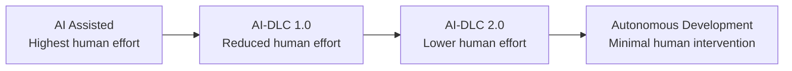
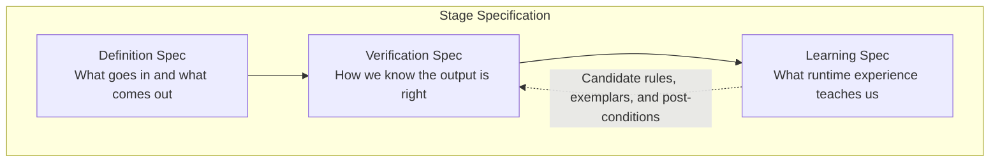
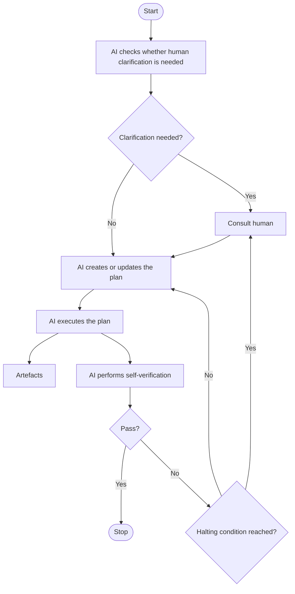

<!-- Converted from raw/AI-DLC-Workflows-2.0-Specification.pdf -->

# AI-DLC Workflows 2.0

## 1. Context & Purpose

AI-DLC (the AI-Driven Development Life Cycle) structures how humans and AI agents participate in software delivery, from requirements through deployment. Version 1 demonstrated the value of running the SDLC as a sequence of stages with a human in the loop. Version 2 keeps the methodology and rebuilds the workflow layer to march progressively towards autonomous software delivery — reducing human intervention as machine-checkable verification expands. Two forces drove the redesign. Customer engagements surfaced demand for finer-grained, composable building blocks that teams could shape to their own delivery flows. The agent platform matured in parallel: new constructs for packaging discrete capabilities (Skills) and for modelling collaborating specialists (multi-agent runtimes) made it possible to express that granularity, and the verification rules that go with it, natively rather than through steering rules alone. v2 also leverages adjacent platform features such as deterministic lifecycle hooks for halting and audit, and MCP for portable tool and context delivery, as tool-specific affordances on top.

## 2. Principles

These principles express the convictions that underpin AI-DLC Workflows 2.0. They shape both our view of emerging AI capabilities and the design choices we make in response.

### Principle 1 — Human Judgement Insights Can Be Distilled into Machines (reducing undifferentated heavy-lifts)

A significant portion of the human effort spent on judgement, validation, and steering AI can be reduced by systematically distilling human decision patterns into machine-executable constructs. This is a prerequisite (and an enabler) for approaching autonomous software development. While we have not yet reached consensus on whether human-in-the-loop can be eliminated entirely, we are aligned on the imperative that we must continue to drive down the human effort required at every stage.

Today, AI-DLC relies heavily on human stakeholders at every stage. Rather than accepting this as permanent, we treat it as a starting condition to optimize. We will identify recurring judgement patterns, codify them into machine-executable form, and progressively widen the scope of what AI can handle autonomously. Not all of this will be achieved from day one, but by laying the right structural foundation now and continuing to hydrate the automation layer over time, we will get there.

### Principle 2 — Every Intent Starts Ambiguous (and That's OK)

Every SDLC business intent begins with some degree of ambiguity. This arises from the human limitation in articulating specifications, their own unknown-unknowns, and the inherent ambiguity of natural language. AI must therefore ask clarifying questions without making assumptions, gather context, and disambiguate intent as much as possible before attempting to solve the problem.

When a stakeholder says, “build me a dashboard for sales performance,” that request contains many unstated assumptions: which metrics, what time range, for which audience, and for what purpose? Humans are naturally imprecise when expressing requirements, and natural language is inherently ambiguous. Rather than treating this as a flaw, we accept it as the natural starting condition. In such cases, the Human-in-the-loop mechanism of AI-DLC will be applied so that AI would clarify and obtain human judgement/validation. We also note that with sufficient upfront preparation in curating intent statements, this stage can be made significantly more efficient.

### Principle 3 — AI as a Self-Correcting Solver (with a Safety Net)

When provided with inputs, expected outputs, and sound, complete post-conditions, AI can _eventually_ converge on a solution by iteratively validating and correcting its work against those post-conditions (ref: [AI Agents as Universal Task Solvers](https://arxiv.org/pdf/2510.12066)). This convergence behaviour (ref: [Karpathy’s autoresearch](https://github.com/karpathy/autoresearch)) relies on three structural properties: the post-conditions must be checkable by a program the AI cannot modify, the success criterion must be tractable, and iteration must be cheap enough for the AI to try many candidates. Stages where these properties hold (e.g. Build & Test, Infrastructure Provisioning) can self-correct to convergence. Stages where validation is less mechanical (e.g. Requirements Analysis, Design Critique, UI Mockups) retain human validation until their post-conditions are hydrated in a sound and complete manner over time.

We call this iterative cycle a _self-correcting loop_ . However, we remain pragmatic: not every problem can be solved within a reasonable time or token budget. That is why every self-correcting loop must include a halting condition, defined either as a maximum number of iterations or a token budget. If AI cannot converge on a valid solution within those bounds, it does not continue indefinitely; it escalates to a human for guidance. This gives us a practical model for autonomy: AI operates independently within well-defined boundaries, and humans are involved only when genuinely needed as ambiguity needs to be resolved or human judgement and validation is essential. This prevents both runaway AI loops and unnecessary human bottlenecks. Principles 4 & 6 below addresses to leverage this self-correction ability efficiently.

### Principle 4 — The Three-Compartment Model

Here we expand how to make Principle 3 operational. The tasks for AI can be expressed in three compartments - the _generation_ specs, the _self-verification_ specs and the _learning specs_ .

- **Compartment 1 — The "What":** Defines what goes in (inputs) and what comes out (outputs). For example, a stage might take User Stories as input and produce a Domain Model as output. Compartment 1 declares inputs, outputs, and any required intermediate artefacts the stage must produce where skipping an intermediate step has been shown to produce poor-quality outputs. For example, identifying events, aggregates, and bounded context boundaries on the way to a Bounded Contexts Design. We name those intermediates as explicit additional outputs rather than embedding imperative instructions. This keeps Compartment 1 declarative while still ensuring the stage produces the artefacts that downstream quality depends on.

- **Compartment 2 — The "How Do We Know It's Right":** Defines the post-conditions — the validation criteria that AI uses to self-check its work. These are the rules, constraints, and quality checks that a correct output must satisfy.

- **Compartment 3 - “What Did We Learn”:** Defines the runtime-learning capture: what observed signals become candidate rules, exemplars, or post-conditions, and how they are proposed for promotion into Compartment 2 or into the shared guardrail library.

Without clear post-conditions, AI has no way to self-correct. Without clear input/output definitions, AI doesn't know what problem it's solving. As in Principle 3, the halting conditions are defined centrally and will be complied always. We also note that the full set of post-conditions ( **soundness and completeness** ) might not be available in the beginning. Therefore, AI will have to escalate for human validation more frequently to start with (as it happens in the current version of AI-DLC workflows). For example, given a requirement to create a Dashboard, AI will have to confirm with the humans on the color schemes. But as we hydrate Compartment 2 incrementally, we will achieve our end goal. In the example quoted, this will be akin to supplying AI with the organization's standards on UI and a post-condition that checks for violations/deviations.

### Principle 5 — Every SDLC Stage Fits the Two-Compartment Construct

The three-compartment construct is sufficiently general to describe every stage of AI-DLC (or any Software Development process) This model is not limited to implementation-heavy stages such as coding or testing. It applies equally to requirements clarification, architecture design, deployment, monitoring, and other lifecycle activities. Whether a stage is creative, analytical, or mechanical, it can still be framed as a transformation from defined inputs to expected outputs, governed by explicit post-conditions.

### Principle 6 — Staged Decomposition Over Single-Shot Compression

We believe it is not practical to compress all Software Development workflow stages into a single-shot process, such as going directly from user intent to deployed code. Such compression would create the burden of defining all post-conditions in one place, including test cases, code quality metrics, non-functional requirements, compliance requirements, and more. It would also create long-running loops, because AI would need to search through a vast space of alternatives to satisfy all post-conditions simultaneously.

It might be tempting to dream of a single prompt - "build me this app" or "fix that technical debt" — that goes straight from intent to deployed, production-ready code. We believe this is impractical for two reasons:

1. **Post-condition explosion:** If we try to validate everything at once (functional correctness, code quality, security, compliance, performance, accessibility, etc.), the validation criteria become overwhelmingly complex and interdependent. Defining and managing all these post-conditions in a single stage is a specification nightmare.

2. **Combinatorial search explosion:** With all constraints applied simultaneously, AI must explore a vast solution space. This leads to long-running, potentially non-terminating loops - exactly the kind of runaway behavior that Principle 3's halting condition is designed to prevent.

Learning from customers over the last year, our prescriptive stage definitions proved too opinionated, and that is where adoption friction arose. For example, AI-DLC 1.0 treats Build & Test as one stage, but for almost all customers it spans multiple activities: reviews, builds, functional tests, security tests, and more. Similarly, some customers produce UI mock-ups alongside User Stories, while others defer them to the Design stage. Therefore, we need a finer-grained, ai-native building block that customers can compose freely.

We introduce _Skills_ as this foundational building block. A Skill represents a discrete capability or expertise that humans historically provided: database design, code review, security analysis etc. Its ai-native representation ([Agent Skills specification](https://agentskills.io/specification)) allows us to model instructions, tools, references etc. mirroring the expertise a human practitioner would bring. We will use Skills as the unit of composition and stages and phases as more flexible _organising_ concepts. We will design a library of Skills using the three-compartment model as in Principle

4.

### Principle 7 — Autonomous Development in Safe Increments Rather than as a Big-Bang

Customers cannot achieve full autonomous software delivery overnight. Real-world organizations carry a significant body of guardrails, no-go-zone rules, compliance requirements, security policies, and domain-specific constraints that must be distilled into machine-executable constructs before AI can operate autonomously. This distillation (soundness and completeness) is inherently incremental as it takes time, organizational alignment, and iterative refinement. AI-DLC Workflows 2.0 is designed to support this reality by enabling customers to adopt autonomy progressively, in safe increments, rather than demanding a big-bang transformation.

Consider a large enterprise with strict regulatory compliance requirements, internal coding standards, security review gates, and architectural governance policies. These constraints exist for good reason, but they are often encoded in documents, tribal knowledge, review checklists, and human judgement. Translating all of this into Compartment 2 post-conditions that AI can enforce autonomously is a substantial undertaking. No customer will complete it in one go. Rather than treating this as a blocker, AI-DLC Workflows 2.0 embraces it as the expected adoption path:

1. **Start with what you have:** Customers begin by defining the post-conditions they already know and can codify — for example, coding standards, naming conventions, or basic security rules. AI operates autonomously within these boundaries and escalates to humans for everything else.

2. **Hydrate incrementally:** Over time, customers progressively distill more of their guardrails, compliance requirements, and domain-specific rules into Compartment 2 definitions. Each addition expands the boundary of what AI can validate and self-correct autonomously — reducing the need for human intervention at that stage.

3. **Expand the safe increment size:** As the post-condition library matures, the scope of what AI can safely execute in a single increment grows. What once required human judgement at every step can now proceed autonomously through multiple stages.

### Principle 8 — Extensibility

We cannot anticipate every customer's guardrail, compliance obligations, domain-specific workflows, or organizational standards. Therefore, extensibility must be a foundational design constraint and not a convenience feature added after the fact. Customers must be able to extend, modify, and compose AI-DLC workflows using the same constructs and with the same guarantees as the vendor-provided baseline. Specifically, the extensibility model must support three scenarios:

1. **Additive extensions:** Customers can extend an existing AWS baseline by layering their own supplementary rules and post-conditions on top of the baseline definitions.

2. **Replacement extensions:** Customers can replace specific rules within an AWS baseline where their requirements diverge from the baseline, taking ownership of the modified stage definition going forward.

3. **Composability:** Customers can introduce entirely new stages — authored using the same three-compartment construct — that AI can intelligently stitch into the workflow.

### Principle 9 — Learning from Practice (Compound Engineering)

The definition of Skills should improve as they are used, not only as they are authored. Each Skill declares, alongside its generation and verification specs, what it learns from runtime interactions (human corrections, re-runs, escape-hatch acceptances) and how those observations become candidate additions to its Compartment 2 library or to the shared guardrail library. Without this layer, the incremental hydration described in Principle 7 depends entirely on manual authoring, which slows adoption. With it, customers hydrate their verification rules from practice as well as from deliberate authoring.

Today, when a human corrects an AI output, that correction is typically applied once and forgotten. Under Principle 9, every correction is a candidate learning. If a user consistently rewrites a particular section of a generated requirements document, the stage can propose a new post-condition capturing that pattern. If a user repeatedly overrides a particular design decision, the stage can propose a guardrail. The proposal is shown to the human for approval before being promoted into the active rule set. This creates a feedback loop where practice itself becomes a source of hydration for the verification library.

## 3. Structure

The core best practices we want to adopt in the new structure are DRY, the separation of concerns and leveraging the tool-specific native features to the fullest (and not in the least-common-denominator basis).

1. A library of Persona-Agents that assume. Just as human teams are composed of specialists who collaborate, Agents are ai-native constructs that model these collaborative dynamics, enabling multi-agent workflows where each agent brings focused expertise to a shared objective.

2. A library of Stages. A stage defines what work must be performed and what artefacts should exist when the stage is complete

3. A library of “Knowledge” that the Agents use for generating and self-correcting their own outputs.

4. An orchestrator definition that uses AI to compose the stages into adaptive workflows and track and manage the execution.

5. A package manager that packages the above into tool-specific artefacts, such as Kiro- or Claude Code-based multi-agent implementations leveraging each platform's specific advantages.

### Generate-Verify-Learn

Each Stage definition follows the Three-Compartment Construct (Principle 4). We will adhere to being "declarative" in the first compartment. The self-verification specs in Compartment 2 will support both **Inferential Verification Rules** expressed as LLM instructions and **Computational Verifications** expressed as Executables (scripts, tools, custom code). These two modes serve fundamentally different verification needs.

The Inferential Verification Rules ( **LLM instructions)** are appropriate for post-conditions that are NOT a binary pass/fail gate. For example, most code review rules are best expressed as LLM instructions. These are quality heuristics where AI can assess compliance with nuance, not absolutes. We remain pragmatic about the reliability of LLM-judged post-conditions. When the same model generates a candidate and then evaluates whether it meets a post-condition expressed in natural language, there is a risk that the model will converge on outputs that satisfy the letter of the check without satisfying its intent. For this reason, a stage whose Compartment 2 contains only LLM-judged post-conditions will not self-halt on its own verification. It still presents its output to the human for validation. As customers distill more of their verification rules into deterministic executables (per Principle 7), the proportion of stages that can self-halt without human intervention increases.

The Computational Verifications **(Executables)** are appropriate for post-conditions that must be enforced deterministically, where there is zero tolerance for ambiguity or probabilistic judgement. For example, a no-go-zone rule like _"no code path shall delete a CloudFormation stack in a production environment"_ or _"no API endpoint shall_ _be exposed without authentication"_ demand deterministic verification must be verified deterministically using a custom linter or static analysis tool, not left to an LLM's interpretation.

The self-correction loop will be implemented using the flow as represented below. AI will assess if it needs further clarification from the humans to execute the stage. It will invoke the human help to clarify the ambiguities. It will continue to execute the task by generating a plan and following it. Upon completing the plan, it will invoke the self-verification loop until either the conditions are met or the halting conditions (iteration limits, token limits etc.) are reached. If AI could not solve within the halting conditions, it will escalate for human help again.

## 4. Orchestrator Definition

The orchestrator composes, sequences, monitors, and adapts the workflow of Skills into coherent end-to-end development flows. It uses each stage's declared metadata to determine how to assemble and execute workflows:

- The declared inputs and outputs (Compartment 1) — what each stage consumes and produces, together with format and dependency expectations

- The purpose of the stage — what transformation or validation it performs

- Any orchestrator hints provided as part of the stage definition — sequencing constraints, conditional triggers, or escalation policies

The orchestrator performs five essential functions:

### a. Goal Ownership

The orchestrator owns the end-to-end objective and remains accountable for delivering the declared outcome of the workflow. It does not delegate goal-tracking to individual stages; it holds the macro view and ensures that the aggregate output of all stages satisfies the original intent.

### b. Workflow Composition

The orchestrator assembles discrete stages into adaptive workflows. Its composition decisions are influenced by: the nature of the intent (greenfield development activates a different sequence than bug-fix or refactoring), available context (if a codebase already has comprehensive documentation, the orchestrator may skip or abbreviate that stage), stage outputs and runtime signals, and customer-authored stages with their orchestrator hints (Principle 8). The orchestrator does not follow a rigid pipeline. It maintains a plan — an ordered composition of stages — but that plan is mutable and adapts as execution proceeds.

### c. Routing, Observability, and Control

The orchestrator is the operational control plane for the workflow. It is responsible for triggering stages with correct inputs drawn from preceding outputs or the original intent, tracking execution state (which stages have run, their outcomes, and artefacts produced), enforcing halting conditions as defined in Principle 3, managing escalations when a stage cannot converge (pausing, surfacing to a human, and resuming upon resolution), and maintaining a full audit trail of every decision — which stages were activated, why, and in what order.

### d. Abstraction Boundary

The orchestrator treats each stage as a black box. It does not interfere with a stage's internal workings — it only validates that declared post-conditions are met upon completion. This separation preserves modularity and allows stages to evolve independently.

### e. Cross-Stage Invariants

Not every post-condition belongs to a single stage. Some invariants span the entire workflow (e.g., naming conventions, security policies, documentation standards). The orchestrator evaluates these cross-cutting invariants at appropriate checkpoints and enforces them as global constraints that no individual stage is solely responsible for.

## 5. The Package Manager

The package manager is responsible for packaging the tool-agnostic definitions of stages and orchestrator into tool-specific ( Kiro, Claude Code, Cursor, or GitHub Copilot) constructs like subagents, skills etc. As much as possible, we will adopt the following to maintain the DRY principle:

- Each stage definition will be maintained in a canonical stage definition file.

- Tool-specific implementations will refer to that file by filename reference rather than physically copying its content into multiple tool-specific artefacts (DRY)

To avoid reducing the tool-agnostic definition to the lowest common denominator across tools, we draw an explicit boundary around what the shared definition covers and what it does not. The shared definition covers stage structure, Compartment 1 and Compartment 2 contracts, orchestrator hints, and the cross-stage post-condition library. It does not cover tool-specific affordances such as Claude Code skill-scoped hooks, Cursor Composer multi-file editing semantics, Copilot Workspace's PR-native loop, or Kiro's spec-kit diff presentation. Each tool-specific emitter is responsible for layering its platform's native affordances on top of the shared definition, so that the generated artefacts leverage what is distinctive about each tool. This way, the shared definition preserves portability without erasing tool-native advantages.

This approach ensures that a stage such as Implementation remains anchored to one single-source-of-truth definition even when used across different tools. It also reduces duplication, simplifies maintenance, and makes updates easier to propagate consistently across all target platforms.

## 6. Implementation Guidelines

1. **Deterministic routing:** stage order and workflow transitions are decided by the orchestration layer.

2. **Agent specialization:** domain judgement is delegated to appropriate expert personas.

3. **Artifact traceability:** each stage declares what it consumes and produces.

4. **Human approval:** non-bootstrap stages require explicit approval.

5. **Tool-owned state:** state and audit transitions are handled mechanically.

6. **Advisory verification:** checks support quality decisions and auditability.

7. **Controlled learning:** new rules are admitted deliberately, not silently.

8. **No hidden delegation:** agents do not recursively spawn other agents; the conductor coordinates agent work.
