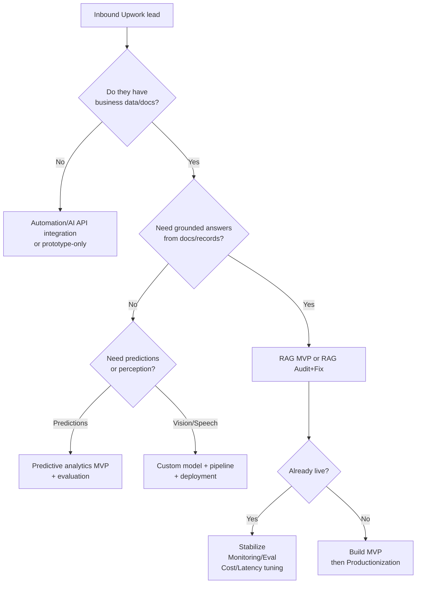
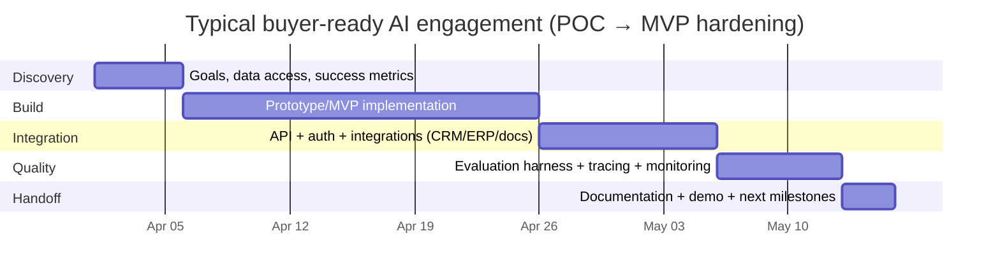

# Upwork AI Buyers and What a Senior Developer Can Sell Them

## Executive summary

Demand for AI work on Upwork is broad and highly segmented: there are thousands of open jobs clustered around chatbots/LLM apps and “AI automation,” alongside a smaller but higher-value stream of work for production ML systems (data pipelines, retrieval, evaluation, and monitoring). At the same time, the “typical budget” signals range from very small tests ($100–$300) to mid-sized MVP builds ($3,000–$6,000) to structured proofs-of-concept ($25,000+) and multi-month retainers—so choosing the right buyer type matters as much as technical capability. citeturn0search6turn0search2turn2search15turn5view2turn5view1turn14view0

The highest-likelihood buyers for an experienced (10+ years) software developer selling AI development services are businesses that (a) have operational complexity and valuable internal data, (b) must integrate AI into existing systems, and (c) care about reliability, governance, and measurable outcomes. On Upwork, those buyers show up most often as B2B SaaS firms modernizing support operations, ops/finance teams automating reporting and decision workflows, recruiting/HR platforms building semantic matching, and organizations deploying retrieval-based assistants grounded in internal docs (SharePoint/knowledge bases) rather than “prompt-only” prototypes. citeturn14view0turn11view0turn7view2turn5view1turn7view4

A practical strategy is to sell **productized, business-outcome-first offerings** that map cleanly to the way Upwork clients post work: (1) diagnostic/architecture consults, (2) tightly-scoped prototypes and MVPs (RAG/search, automation agents, LLM backends), and (3) productionization packages (deployment, monitoring, evaluation, MLOps). Upwork already has a large “Project Catalog” for AI & Machine Learning with thousands of purchasable projects and common delivery-time expectations (2–7 days for small packages; longer for full builds), so standing out requires being the “production and integration” specialist rather than another generic chatbot builder. citeturn13view0turn5view2turn12view0turn15view0turn7view1

## Upwork demand patterns and the businesses most likely to buy senior AI development

Upwork’s public job-category pages show very large volumes in conversational/LLM-adjacent work. For example, pages like “AI Chatbot” and “Chatbot Development” display thousands of open jobs at any given moment, suggesting a broad buyer base for LLM applications and automation-adjacent chat experiences. citeturn0search6turn0search2turn0search14

At the same time, the “buyers most likely to pay for seniority” are not the median of that volume. They are the subset that needs fewer freelancers, but deeper outcomes: production-grade pipelines, governance, integrations, and accountability. This is visible in recent job posts that explicitly request architecture, documentation, deployment, monitoring, evaluation metrics, multi-system integrations (ERP/finance/CRM), or restrictions such as local/on-prem requirements. citeturn5view2turn11view0turn12view1turn11view3turn15view0

The table below summarizes **high-probability Upwork buyer sectors** (i.e., most likely to buy senior AI dev services) and what they typically purchase.

| High-likelihood sector on Upwork | Common buyer persona posting the job | What they’re buying (signals of seriousness) | Best-fit productized offers for a senior dev | Typical budget & timeline signals seen in recent posts |
|---|---|---|---|---|
| B2B SaaS (support + knowledge ops) | Head of Support Ops, Product Lead, CTO | Clean/maintained knowledge foundations (ETL, dedupe), vector search, baseline metrics, “AI agents that resolve tickets,” ongoing data quality pipelines | Data + Knowledge Base “AI Readiness” sprint; Support KB RAG assistant; RAG evaluation/observability setup | €1,800–€2,200 monthly retainer + longer engagement; fixed-price starter milestones (e.g., $2,400) citeturn14view0 |
| Enterprise/IT modernization (Microsoft/Azure ecosystems) | IT lead, Solutions Architect | Search + indexing (AI Search), governance/identity, integrations into enterprise systems, documented best practices | “Azure AI Search + Copilot retrieval assistant” integration package; governance-first architecture | 4-month engagement; ~$1,200–$1,500/month in one recent posting (often negotiable upward for true senior scope) citeturn7view1 |
| Ops/Finance automation | Fractional CFO, Ops Director | Daily reporting + commentary, automation reliability, handling messy data, explicit “not just connect tools” requirements | “Finance Ops AI Automation” package; data hygiene + guardrails + output quality; KPI dashboards with AI interface | Hourly bands like $50–$100/hr for automation + AI commentary workflows; 1–3 month durations citeturn10view0 |
| Integrations-heavy ops (ERP + CRM + analytics) | COO, Revenue Ops | System connection work (ERP + finance + CRM), AI query interface, automated reports, phased hourly→milestones | “AI-enabled RevOps stack integration” (ETL + CRM + LLM interface); secure internal analytics assistant | 3–6 month durations; hourly ranges like $35–$80/hr in one post citeturn11view0 |
| Recruiting / HR tech | Founder, Product Manager | Semantic matching/ranking beyond embeddings, deployable backend service, clear API deliverables | Resume/Job matching engine MVP; structured ranking + evaluation harness; deployment-ready backend | Phase budgets like $4,000–$6,000 for Phase 1 and expansion scope afterward citeturn7view2 |
| Sales enablement / training + internal docs (SharePoint/KBs) | Enablement Lead, Sales Ops | Grounded answers + citations/links to source materials, KB integration, admin updates, mobile-friendly UI | “SharePoint RAG Sales Coach” MVP; admin tooling + content refresh pipeline | MVP budgets like $3,000–$5,000 with expert experience expectations citeturn5view1 |
| Computer vision for clinics/consumer devices | Founder, Product Owner | End-to-end: data collection + labeling pipeline + training + validation + monitoring + app integration | CV MVP + training pipeline; labeling QA process; monitoring and retraining runbooks | Fixed-price MVPs with explicit monitoring/retraining requirements appear; one sample shows full pipeline expectations for a “Skin Scan Station” citeturn5view5turn16search26 |
| Speech / audio intelligence (retail monitoring, call analytics) | Product/Tech Lead | “Production-ready pipeline code,” deployment scripts, benchmarks, model selection rationale | Speech pipeline build + evaluation; diarization/transcription QA harness; deployment and monitoring | Example fixed-price ~ $1,000 for a 3-week engagement with strong deliverables language citeturn12view0 |

These sectors have a common thread: they are not buying AI as a novelty. They are buying **systems**—data flows, retrieval/search, APIs, deployment, monitoring, and measurable improvements in throughput/cost/quality. That aligns strongly with an experienced software developer’s advantage (architecture + reliability + “make it run in production”). citeturn14view0turn5view2turn12view0turn15view0turn7view4

## Common problems businesses hire AI freelancers to solve on Upwork

Across recent postings, the most frequent “AI buyer problems” cluster into a few repeatable jobs-to-be-done patterns.

**Grounding LLMs in business data (RAG/semantic search)**
Clients frequently request document ingestion, embeddings, vector database setup, and an API/chat interface—often with explicit deliverables like architecture explanations and run instructions. citeturn7view0turn7view4turn7view5turn5view1

**Stabilizing and improving already-built chatbots**
Many buyers already have something live and want debugging, performance improvements, integration with tools/CRMs, and “production stability, monitoring, and scalability.” This is a classic entry point for senior dev positioning (audit + fix + harden). citeturn5view4turn12view1

**Agentic automation and workflow orchestration**
“AI automation” requests commonly combine LLM reasoning with step execution across APIs and tools. Some are small ($15–$100 quick tasks), but higher-quality buyers define architectures, insist on documentation and demos, and budget real POCs (e.g., $25,000 for 6 weeks). citeturn2search19turn5view2turn10view0turn12view2

**Enterprise integration and governance**
Buyers in Microsoft/Azure environments ask for AI Search, Copilot-style solutions, governance via identity systems, and integration into enterprise data sources. These are integration-heavy and reward senior engineering. citeturn7view1

**Evaluation, monitoring, and compliance constraints**
Some postings explicitly require evaluation services, PII redaction layers, tracing/observability, regression tracking, or non-cloud deployments for sensitive data. These are higher-trust engagements where “senior” often matters more than “latest framework.” citeturn15view0turn11view3turn19view2

**Specialized ML (computer vision, speech) with production constraints**
When buyers need model swaps, latency targets, weekend deadlines, or full pipelines, they tend to specify performance metrics (e.g., IoU targets, inference latency) and deployment environments (GPU serverless, Flask backend). citeturn19view0turn12view0turn16search26

Upwork itself frames 2026 as a shift from experimentation toward execution for SMBs—moving from “trying LLMs” to building integrated systems that deliver revenue/profit—matching the above job patterns. citeturn4search2

## Specific AI services and productized offerings you can sell

A senior developer’s strongest commercial advantage is to package AI work into **buyable outcomes** with clearly-defined deliverables and risk controls. Upwork’s Project Catalog already contains a very large number of purchasable AI & Machine Learning projects (tens of thousands listed on the AI & Machine Learning services page) with common delivery-time expectations and “from $X” pricing anchors—so competing as “yet another chatbot builder” is hard; competing as “the person who makes it reliable, measurable, and integrated” is easier. citeturn13view0turn5view4turn15view0turn7view4

Below is a service catalog mapped to the buyer problems visible in recent posts, using the user-requested categories (consulting, prototypes, MVPs/“MLPs,” production pipelines, MLOps, labeling, fine-tuning, embeddings/search, RAG, chatbots, automation, analytics, custom models, APIs/integrations, monitoring).

| Offer category | What you sell (productized “package”) | Concrete deliverables businesses expect on Upwork | Tech stack options clients commonly cite | Best-fit buyer types |
|---|---|---|---|---|
| Consulting (strategy + architecture) | “AI Feasibility + Architecture Decision” (60–120 min consult + written plan) | Architecture diagram; data requirements; risk register (privacy/hallucinations); milestone plan and budget estimate | Python; cloud-neutral; vendor-neutral LLM APIs | Logistics support consult/example; enterprise governance planning citeturn12view3turn7view1 |
| Prototypes / Proofs of concept | “2–4 week AI Prototype that Demonstrates Value” | Working prototype; demo walkthrough; source code; clear next-step production plan | Python + FastAPI; LangChain; vector DB; cloud | POC-style AI automation/orchestration engagements citeturn5view2 |
| MVP / MLP builds (LLM apps) | “RAG MVP: Documents → Search → Chat” | Ingestion pipeline; embeddings + vector DB; API + simple UI; deployment instructions; admin refresh | FastAPI/Node; vector DBs; LLM APIs; React/Next.js | SaaS doc-bots; SharePoint-trained assistants; competitive intel bots citeturn5view1turn7view5turn7view3 |
| Production ML pipelines | “Productionization Sprint: from notebook/prototype to service” | CI/CD; deployment scripts; tests; perf benchmarks; rollback plan | Docker; Kubernetes optional; cloud services; observability | Speech pipelines, CV model swaps, stabilized deployed bots citeturn12view0turn19view0turn12view1 |
| MLOps / operations | “Model Ops: monitoring + drift + retraining hooks” | Monitoring dashboards; alerting; retraining triggers; model registry conventions | MLflow/W&B; CI/CD; infra-as-code | Multi-tenant LLM systems and production monitoring requirements citeturn19view2turn16search26 |
| Data labeling (delivery via managed workflow) | “Labeling System + QA + Vendor/Annotator Workflow” | Labeling guidelines; QA sampling; inter-annotator agreement process; dataset versioning | CVAT/Labeling tools; storage; QA scripts | CV buyers with full pipeline needs; time-to-train constraints citeturn16search26turn16search7turn2search1 |
| Fine-tuning (LLMs / CV / audio) | “Fine-tune Open Models + Deployable Artifact” | Fine-tuned weights; training scripts; evaluation report; deployment container; documentation | PyTorch; Hugging Face; LoRA/QLoRA; Docker; GPU env | EdTech tutoring fine-tuning role; niche fine-tunes like audio style transfer citeturn17view3turn17view1turn19view1 |
| Embeddings + semantic search | “Vector DB + Hybrid Search + Cost Optimization” | Chunking strategy; indexing pipeline; latency/cost tuning; access control | pgvector/other vector DBs; hybrid search | “Vector Database Expert” postings; resume matching engines citeturn7view4turn7view2turn15view0 |
| RAG hardening | “RAG Audit + Fix + Accuracy/Latency Upgrade” | Retrieval debugging; prompt + chain fixes; eval set; guardrails; monitoring | LangChain/LangGraph; vector DB; eval frameworks | Live chatbot improvements and stabilization jobs citeturn5view4turn12view1turn15view0 |
| Chatbots (customer support / internal assistants) | “Customer Support AI Assistant with Citations + Escalation” | Source citations; fallbacks; human handoff; usage logging; admin content edit | web widget + backend; CRM integrations | Customer support automation startups; logistics support; SaaS enablement citeturn1search16turn12view3turn5view1 |
| Automation + integrations | “AI-Driven Workflow Automation (ops/sales/finance)” | API integrations; workflow scenario; “messy-data” handling; non-generic outputs | automation platforms + APIs; Python optional | CFO daily insights; ERP/CRM automation projects citeturn10view0turn11view0turn5view2 |
| Analytics + decision support | “AI Query Layer over Company Data + KPI Reporting” | Data connectors; unified schema; dashboards; natural-language query interface | SQL + Python; BI tools; LLM query layer | ERP/finance/ops automation; SaaS support metrics baselines citeturn11view0turn14view0 |
| Custom models (CV/speech/predictive) | “Custom Model + Validation + Deployment Plan” | Model training pipeline; metrics; bias/perf analysis; integration | PyTorch/TensorFlow; OpenCV; GPU deployment | Clinic CV platform; speech pipeline for retail monitoring citeturn5view5turn12view0turn19view0 |
| APIs, integrations, monitoring | “API-first AI service with SLOs” | REST API; auth; rate limiting; observability; incident playbook | FastAPI/Node; cloud deployment | Resume matching backend; eval services; enterprise assistants citeturn7view2turn15view0turn7view1 |

A useful alignment with current Upwork buyer language is that “LLM skills in highest demand” for Python developers include frameworks for agents, building RAG pipelines, and fine-tuning open-source models—exactly the categories above. citeturn4search13turn17view3turn5view2

### A decision flow to route buyers into your best offer



This flow matches recurring Upwork posting patterns around RAG assistants, automation, and production ML constraints. citeturn7view0turn5view4turn5view2turn12view0turn19view0

## Typical project scopes, deliverables, timelines, and pricing ranges on Upwork

### Pricing anchors from Upwork’s own “cost to hire” guidance

Upwork publishes client-facing cost guidance that is useful as a baseline:

Machine learning engineers often fall in a broad band (commonly $50–$200/hr) with experience-tier breakdowns and median hourly estimates, and Upwork also provides examples of small fixed-price ML projects in the low-thousands. citeturn3search0turn0search3turn1search7

Chatbot developers have a lower published median range than senior ML engineering roles, reflecting how much “chatbot work” is integration/implementation rather than research-grade modeling. citeturn2search2

Upwork’s AI engineer guidance includes project-size buckets, showing that “small fixed-price” AI projects often start around the hundreds to low-thousands, while medium and large fixed-price projects can range from several thousand to tens of thousands depending on complexity. citeturn2search15turn3search4

Upwork also clarifies contract modes and minimums (hourly vs milestones/escrow) which affects how you should package risk and deliverables. citeturn2search14turn2search21turn2search6

### Real posting examples showing scope and budget dispersion

Recent postings illustrate why a senior dev should filter aggressively and attach pricing to outcomes:

* A “simple RAG chatbot for a website” can be posted at $200 fixed and request ingestion, embeddings, vector DB, and a working API—an underbudgeted scope for most senior engineers unless sharply reduced. citeturn7view0  
* A more business-critical internal sales training assistant (SharePoint-backed) is budgeted at $3,000–$5,000 for an MVP and includes structured response formats and admin updating needs. citeturn5view1  
* A “semantic resume matching engine” is explicitly budgeted around $4,000–$6,000 for Phase 1 with clear backend deliverables and expansion potential—closer to what experienced builders should target. citeturn7view2  
* AI automation POCs are sometimes priced as professional prototyping engagements (e.g., $25,000 for a 6-week POC with architecture, demo, and documentation deliverables). citeturn5view2  
* Production ML “surgery” can be extremely time-bound (weekend integration, performance targets, deployment constraints), rewarding a senior dev who can execute safely in existing codebases. citeturn19view0turn12view1turn5view4  

### A pragmatic pricing and timeline matrix for your offerings

The following table translates Upwork’s pricing anchors + observed job patterns into “sellable” packages for a senior dev (your actual rates should reflect niche expertise and proof).

| Offering (productized) | Typical scope boundary | Deliverables that reduce buyer risk | Typical timeline | Practical price bands seen/anchored on Upwork |
|---|---|---|---|---|
| Architecture + feasibility consult | One workflow/use case; one data source | Written architecture + milestones + budget ranges | 1–3 days turnaround | Project Catalog consults can start in the low-hundreds; higher for senior architecture work citeturn13view0turn12view3 |
| RAG MVP (docs → chat) | Limited data sources, one retrieval mode, basic UI | Ingestion + embeddings + vector DB + API + docs | 2–6 weeks depending on UI/integrations | From small AI project buckets ($500–$1,000+) up to $3k–$6k+ when integrations/admin widgets exist citeturn2search15turn5view1turn7view5 |
| RAG audit + hardening | Existing bot; focus on accuracy/latency/cost | Root-cause report, fixes, eval set, monitoring plan | 1–3 weeks | Often best sold hourly or as fixed “audit sprint”; job posts show wide variance (some underbudgeted) citeturn5view4turn12view1turn2search30 |
| AI automation POC (agents + workflows) | Demonstrate 1–2 end-to-end workflows | Architecture, working demo, code, documentation | 4–6 weeks common | High-quality POCs can reach five figures; one example is $25k / 6 weeks citeturn5view2 |
| Enterprise data + knowledge foundation | Audit + pipeline build + baseline KPIs | ETL pipelines, dedupe, metrics baseline, KB structure | 1–3 months to baseline | Retainers and long-term engagements are common; one post cites €1,800–€2,200/month retainer with a separate fixed-price milestone citeturn14view0 |
| Semantic matching engine (HR/recruiting) | One ingestion path, one ranking API | Deployed backend service + ranking logic + docs | 4–8 weeks | Phase budgets around $4k–$6k appear for backend builds citeturn7view2 |
| CV / speech pipeline in production | Performance targets + integration | Tested pipeline, deployment scripts, benchmarks | 3–6 weeks typical | Fixed-price examples exist (e.g., ~$1,000 for a 3-week speech pipeline engagement; higher for full CV platforms) citeturn12view0turn5view5turn19view0 |
| Fine-tuning open models + deployment | 1 model family, 1 dataset, eval harness | Weights, scripts, eval report, container, docs | 3–4 weeks common | Phase 1 budgets like $1k–$3k are posted for LLM fine-tuning roles, with long-term expansion potential citeturn17view3turn17view1 |

### A mermaid timeline for a common “buyer-ready” engagement

Below is a timeline you can use to propose a fixed-scope engagement that matches how serious Upwork clients describe POCs and MVPs (architecture, build, integration, demo, documentation). citeturn5view2turn7view2turn5view1



This structure aligns with the way higher-quality postings define deliverables (architecture + working POC + documentation + demo) and with the emergence of evaluation/observability asks in RAG projects. citeturn5view2turn15view0turn12view0

## Competitive landscape and differentiators for a senior developer

The competitive landscape is intense in two ways:

First, there are thousands of jobs in broadly defined “chatbot/AI chatbot” categories, which attracts many applicants and commoditizes generic implementations. citeturn0search6turn0search2

Second, Upwork’s Project Catalog shows very large supply for AI & Machine Learning “projects” purchasable directly, including low-priced, fast-delivery offerings—meaning buyers can compare you to productized alternatives even when they post a job. citeturn13view0

To compete as a senior developer, you need differentiators that map to **what serious buyers repeatedly ask for**:

**Production engineering and reliability**
Many postings explicitly require “production-ready,” “documented, tested,” deployment scripts, and measurable benchmarks—especially in speech pipelines and ML model swaps. citeturn12view0turn19view0turn12view1

**Integrations as the core value**
A large share of AI ROI comes from connecting AI to business systems (ERP/finance/CRM, ticketing systems, doc stores) and automating workflows end-to-end, not from “prompting.” citeturn11view0turn10view0turn14view0turn7view1

**Evaluation, observability, and governance**
RAG buyers increasingly want evaluation services, PII redaction layers, tracing/observability integrations, and regression tracking—areas where senior engineers can be rare on marketplaces. citeturn15view0turn19view2turn11view3

**Clear scope control**
A recurring pattern is that postings can underprice their stated scope (e.g., a multi-component RAG build posted at $200 fixed, or an advanced evaluation system priced at low hourly bands). A senior differentiator is offering a scope-correct plan with milestone gates, explicit acceptance criteria, and “what’s not included.” citeturn7view0turn15view0turn2search30

**Buyer vetting and expectation setting**
Some highly ambitious postings come from low-spend or new clients, while some high-spend clients also post low budgets (misaligned incentives). A senior dev can protect time by using a short “discovery sprint” and by tying continued work to measurable signals (data access, stakeholder availability, test harness readiness). citeturn20view0turn14view0turn5view1

## Recommended Upwork sales and marketing approach with sample gig copy

### Positioning on your profile

Your profile should read like a systems builder, not an “AI generalist.” Upwork’s own examples of strong freelancer headlines for AI engineers frequently emphasize LLMs/RAG/custom tools and business problem solving—consistent with the niche positioning recommended here. citeturn4search25turn4search13

A senior-leaning positioning statement that fits observed buyer demand:

* “I build **production-ready AI systems**: RAG knowledge assistants, semantic search/matching engines, AI automation workflows, and ML pipelines—with evaluation, monitoring, and integrations into your stack.” (Tie directly to what serious job posts request: deployment, documentation, monitoring, APIs, integrations.) citeturn5view2turn7view2turn12view0turn15view0turn11view0

### Proposal mechanics mapped to Upwork’s buyer workflow

Upwork emphasizes structuring job posts and hiring steps (targeted posts, review proposals, agree on scope). Use that by writing proposals that look like mini project plans: brief diagnosis, proposed milestones, acceptance criteria, and a “risk + mitigation” section. citeturn4search7turn2search14turn2search30

Upwork also publishes proposal/cover-letter guidance and example styles; while you should avoid “AI-generated generic” proposals, you *can* adopt the structure: quick relevance proof + plan + a couple of aligned questions. citeturn4search29turn10view0turn7view2

### Productized “Project Catalog” packages you can list (with buyer-ready value propositions)

Upwork’s Project Catalog for AI & Machine Learning shows buyers are already purchasing packaged services with very explicit delivery times and entry prices, including chatbots, RAG consulting, and automation setups. That makes productization a practical acquisition channel if your packages are clearly “senior-grade.” citeturn13view0turn12view3turn5view4

Below are sample packages written in a “business buyer” voice, designed to align with common posting language.

**Package: RAG MVP for Internal Docs (SharePoint/Drive/Notion-style sources)**
Value proposition: “Ground answers in your documents, return citations/links, and keep content refreshable without rebuilding your whole system.”
Deliverables: ingestion pipeline, embeddings + vector DB, API, basic UI, admin refresh flow, deployment instructions, and an evaluation starter set.
Fit: Enablement/support teams; doc-heavy orgs. citeturn5view1turn7view5turn12view2turn14view0

**Package: RAG Audit + Accuracy/Latency Upgrade (for a bot that’s already live)**
Value proposition: “You already shipped. I’ll make it faster, more accurate, and easier to maintain—with measurement.”
Deliverables: root-cause report, retrieval fixes, prompt/chain refactor, cost/latency improvements, monitoring/tracing starter.
Fit: Teams experiencing hallucinations, slow retrieval, or brittle deployments. citeturn5view4turn12view1turn15view0

**Package: AI Automation POC (Agents + Tool Use)**
Value proposition: “A demonstrable POC that automates one real workflow end-to-end—integrated with your APIs—plus a plan for production.”
Deliverables: architecture, working POC, code + docs, demo walkthrough; optional handoff plan for scaling.
Fit: Ops-heavy businesses; teams seeking stakeholder buy-in. citeturn5view2turn11view0

**Package: Semantic Search / Matching Engine (Recruiting, Marketplace, Catalog Search)**
Value proposition: “Better-than-embedding-similarity ranking with a deployed backend service.”
Deliverables: ingestion + normalization, embeddings + vector DB, ranking logic, REST API, deployment.
Fit: HR/recruiting platforms and marketplaces. citeturn7view2turn7view4

**Package: Production ML Deployment + Monitoring Starter**
Value proposition: “Turn a working model into a service you can operate: deploy, monitor, alert, and roll back.”
Deliverables: CI/CD, containerization, deployment scripts, baseline dashboards, alert definitions.
Fit: Speech/CV/predictive systems moving to production. citeturn12view0turn19view0turn19view2turn16search26

**Package: Fine-tune Open Models for a Specific Domain**
Value proposition: “Fine-tune + evaluate + package for deployment—reproducibly.”
Deliverables: weights, scripts, eval report, dockerized inference, documentation.
Fit: EdTech tutoring, domain-specific assistants, specialized content. citeturn17view3turn19view1turn17view1

### Sample “job-responding” mini-pitches (proposal openers)

Each is tailored to common business-buyer postings and includes the “senior differentiator” (measurement, reliability, integration, handoff).

**For SaaS support knowledge foundation**
“I can take ownership of the messy-data-to-usable-knowledge pipeline: audit sources, build ETL to clean/dedupe, stand up a retrieval-ready knowledge store, and define baseline support KPIs so the AI initiative has measurable targets.” citeturn14view0

**For SharePoint-based sales enablement bot**
“I’ll build an MVP that pulls answers from SharePoint training materials and returns structured outputs (scripts, objection handling, and links to source docs), with an admin workflow so your content stays current.” citeturn5view1

**For resume matching engine**
“I’ve built API-first backend systems; I’d approach this as an evaluation-driven matching service: ingestion + normalization, embedding retrieval, then ranking beyond similarity via structured weighting and test cases to prevent regressions.” citeturn7view2turn15view0

**For ops/finance daily insights automation**
“I’m not just wiring tools together—I’ll design the data structure and guardrails so the outputs are CFO-grade, handle messy transaction data, and produce consistent daily emails with predictable formats.” citeturn10view0

**For speech pipeline deployments**
“I’ll deliver production-ready, tested pipeline code with deployment scripts and benchmarking against your prototype, and I’ll document model selection and tuning decisions so the system can be maintained after handoff.” citeturn12view0

### Operational advice: how to avoid underbudget traps while staying competitive

Because Upwork includes both hourly and milestone-based contracts—and because posted budgets can be misaligned with scope—use a “two-step close”:

1) Sell a short paid discovery/audit sprint (fixed price), producing a written plan + milestones.  
2) Convert to milestone-based delivery or hourly with explicit weekly caps and acceptance criteria. citeturn2search14turn2search30turn7view0turn5view2

This approach matches how serious clients describe their own preferred process (start hourly to test collaboration, then define fixed-price milestones) and reduces risk for both sides. citeturn11view0

### Selected source links (copy/paste)

```text
Upwork AI & Machine Learning Project Catalog (projects, pricing, delivery times)
https://www.upwork.com/services/ai-machine-learning

Upwork “Chatbot Development” jobs page (category demand signal)
https://www.upwork.com/freelance-jobs/chatbot-development/

Upwork “AI Chatbot” jobs page (category demand signal)
https://www.upwork.com/freelance-jobs/ai-chatbot/

Upwork cost to hire: Machine Learning Engineers
https://www.upwork.com/hire/machine-learning-experts/cost/

Upwork cost to hire: Chatbot Developers
https://www.upwork.com/hire/chatbot-developers/cost/

Upwork hiring costs by project size: AI engineers
https://www.upwork.com/hire/artificial-intelligence-engineers/

AI Automation POC posting example ($25k / 6 weeks)
https://www.upwork.com/freelance-jobs/apply/Automations-Engineer_~022032002425107835115/

SharePoint RAG sales training bot posting example ($3k–$5k MVP)
https://www.upwork.com/freelance-jobs/apply/Build-Chatbot-RAG-for-Sales-Training-SharePoint-Integration_~022031381815736093912/

Resume matching engine posting example ($4k–$6k Phase 1)
https://www.upwork.com/freelance-jobs/apply/Senior-Backend-Engineer-Contract-Build-LLM-Resume-Matching-Engine-Python-Vector_~022027693687665708938/

Vector DB expert posting example (RAG + hybrid search)
https://www.upwork.com/freelance-jobs/apply/Vector-Database-expert_~022032737230394055728/

SaaS data/knowledge foundation posting example (retainer + ETL + KB)
https://www.upwork.com/freelance-jobs/apply/Data-Knowledge-Engineer-Structure-the-Foundation-for-Transformation-SaaS-Company_~022037312653665311517/

Upwork policy: minimum hourly and fixed-price rates
https://support.upwork.com/hc/en-us/articles/211062988-What-are-the-minimum-hourly-and-fixed-price-rates-on-Upwork

Upwork: decide between hourly and fixed-price
https://support.upwork.com/hc/en-us/articles/17931377993107--Decide-between-hourly-and-fixed-price-contract
```